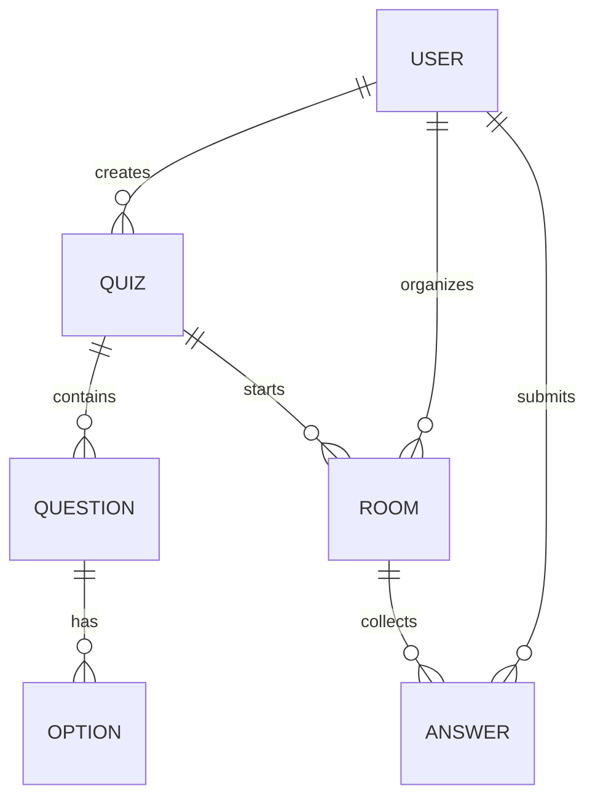

# Модель базы данных

Для MVP используется JSON-файл `data/db.json`. По смыслу его можно заменить на таблицы реляционной базы данных.

## Сущности

### User

Пользователь системы.

| Поле | Тип | Описание |
| --- | --- | --- |
| `id` | string | Уникальный идентификатор |
| `name` | string | Имя пользователя |
| `email` | string | Email для входа |
| `role` | string | `organizer` или `participant` |
| `passwordSalt` | string | Соль пароля |
| `passwordHash` | string | Хэш пароля |
| `createdAt` | string | Дата регистрации |

### Quiz

Квиз, созданный организатором.

| Поле | Тип | Описание |
| --- | --- | --- |
| `id` | string | Уникальный идентификатор |
| `ownerId` | string | ID организатора |
| `title` | string | Название квиза |
| `description` | string | Описание |
| `category` | string | Категория вопросов |
| `questionTimeLimit` | number | Время ответа в секундах |
| `rules` | string | Правила проведения |
| `questions` | Question[] | Список вопросов |
| `createdAt` | string | Дата создания |
| `updatedAt` | string | Дата обновления |

### Question

Вопрос внутри квиза.

| Поле | Тип | Описание |
| --- | --- | --- |
| `id` | string | Уникальный идентификатор |
| `type` | string | `text` или `image` |
| `prompt` | string | Текст задания |
| `imageUrl` | string | Ссылка на изображение |
| `answerMode` | string | `single` или `multiple` |
| `points` | number | Баллы за правильный ответ |
| `options` | Option[] | Варианты ответа |

### Option

Вариант ответа.

| Поле | Тип | Описание |
| --- | --- | --- |
| `id` | string | Уникальный идентификатор |
| `text` | string | Текст варианта |
| `correct` | boolean | Является ли вариант правильным |

### Room

Запуск конкретного квиза.

| Поле | Тип | Описание |
| --- | --- | --- |
| `id` | string | Уникальный идентификатор |
| `quizId` | string | ID квиза |
| `ownerId` | string | ID организатора |
| `code` | string | Код комнаты |
| `status` | string | `lobby`, `question`, `finished` |
| `currentQuestionIndex` | number | Номер текущего вопроса |
| `questionStartedAt` | string/null | Время начала текущего вопроса |
| `participants` | array | Участники комнаты |
| `answers` | Answer[] | Ответы участников |
| `startedAt` | string | Время запуска |
| `finishedAt` | string/null | Время завершения |

### Answer

Ответ участника.

| Поле | Тип | Описание |
| --- | --- | --- |
| `id` | string | Уникальный идентификатор |
| `userId` | string | ID участника |
| `userName` | string | Имя участника на момент ответа |
| `questionId` | string | ID вопроса |
| `selectedOptionIds` | string[] | Выбранные варианты |
| `submittedAt` | string | Время отправки |
| `isCorrect` | boolean | Правильный ли ответ |
| `points` | number | Начисленные баллы |

## Связи

## Правила подсчёта баллов

Ответ считается правильным, если набор выбранных вариантов полностью совпадает с набором правильных вариантов. Для одиночного выбора должен быть выбран ровно один вариант. Для множественного выбора можно выбрать несколько вариантов, но лишний неправильный вариант делает ответ неверным.
